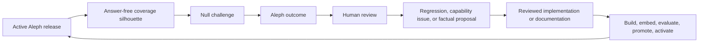

# Ouroboros: continuing the Aleph–Null improvement loop

This document is for the next Wildcat operator who wants to make Aleph more
capable by directing a controlled Project Null review wave, turning the useful
results into reviewed changes, and cutting the next evaluated Aleph release.
It is deliberately self-contained: possession of the earlier development chat
is not required.

The loop is called Ouroboros because its output becomes its next input:

This is directed corpus and evaluation improvement, not online model training.
Telegram traffic never alters Aleph's beliefs in place. A language model may
help select exact evidence or vary a synthetic question only behind explicit
validators; humans still decide what becomes code, an evaluation case, or
published Wildcat documentation.

For locally resumed or daemon-directed operation, use
[`ops/LOCAL-OUROBOROS.md`](ops/LOCAL-OUROBOROS.md). Its receipt-driven
controller preserves this runbook's ordering and stop conditions across chat or
process restarts. It is implemented but has never initialised a cycle; see
[Current implementation boundary](#current-implementation-boundary). It does not
replace any human review, release approval, or production authority defined
below.

## Current implementation boundary

Local inference is not part of this loop. Aleph answers extractively and Null
generates probes deterministically; there is no local model on either side, and
no tunnel, tailnet or restricted SSH account is required to operate either.

Earlier revisions described an optional Aleph writer and an optional Null
paraphraser, together with the network apparatus needed to reach a model on an
operator's machine from the droplet. All of it has been removed. If shadow
inference returns it will be as an offline harness measured against the golden
set, not as a component of the serving path, and the decision to reintroduce it
should be made deliberately rather than inherited from this document.

The corresponding Null-side guide is
[`project-null/OUROBOROS.MD`](https://github.com/wildcat-finance/project-null/blob/main/OUROBOROS.MD).

## The invariant

One person holds the Ouroboros operator turn at a time.

The turn is a claim in the tracking issue. It costs nothing to take, requires no
infrastructure, and is all that is needed to direct a review wave.

Other contributors may review responses, issues, diffs, and pull requests while
a turn is active. They must not start a second Null wave, alter production
state, or activate an Aleph release until the holder records a handoff and gives
the turn up.

The turn combines exactly two things:

1. an individually attributable Wildcat identity; and
2. a declared start time and latest planned stop time.

## What the turn does not grant

Holding the turn does not grant:

- the Aleph or Null Telegram token;
- the Data Gateway bearer token;
- the Aleph audit HMAC key;
- `/etc/aleph/*.env` or `/etc/project-null/*.env`;
- the Null SQLite database or raw Telegram records;
- corpus-signing or GitHub merge authority; or
- permission to bypass issues, review, evaluation, promotion, or activation.

The bots, secrets, data, embeddings, release artifacts, and audit state stay on
the droplet and are reached through ordinary administrative access, which the
turn says nothing about.

## Roles

### Ouroboros operator

The current turn holder may:

- pause, configure, resume, and re-pause a controlled Null wave;
- correlate and classify outcomes;
- open issue-first implementation or documentation work;
- build and evaluate candidates; and
- prepare a release or deployment for the separately authorized activation
  step.

### Reviewer

A reviewer may inspect Telegram outcomes, submit or check feedback, review
factual evidence, review pull requests, and reject unsafe candidates. Review
does not require holding the turn.

### Infrastructure administrator

An infrastructure administrator manages the Wildcat identity group,
administrative access to the droplet, Null's operator allowlist, and emergency
revocation. This role does not automatically decide corpus truth.

### Release approver

The approver accepts a corpus diff or release activation under the existing
Aleph release policy. Holding the turn does not make an operator an approver.

## Operator onboarding

An infrastructure administrator completes all of these:

1. verify the person's current Wildcat role;
2. grant the administrative access appropriate to that role;
3. map the operator's Telegram user ID into Null's root-only operator allowlist
   if they will run review commands; and
4. run positive and negative connectivity tests.

Operator Telegram IDs live only in the root-owned environment file on the
droplet. They identify employees and do not belong in an issue, a pull request,
or this repository.

## Take the turn

### Claim the operational turn

Before doing anything:

1. check the current Ouroboros tracking issue and Telegram training room for an
   active holder;
2. assign or comment with your Wildcat identity, intended task, start time, and
   latest planned stop time;
3. confirm Null is paused; and
4. record the active Aleph release, activation, evaluation, corpus, index, docs
   tag, and both monitor states.

Do not put tokens, environment values, raw questions, wallet identifiers,
Telegram user IDs, or database content in the claim comment.

That is the whole procedure. There is no tunnel to open and no listener to
check.

## Direct a review wave

A review wave is the bounded Telegram probe/review/finalise slice below. The
Ouroboros cycle is larger: it ends only after all resulting candidates have been
dispositioned, reviewed changes have passed evaluation and activation, Aleph's
complete report has been applied by Null, and `candidate_pile=0` is verified.

Refer to every active runtime as **evolution N/generation M**. Generation is
local to its evolution and starts at 1. Declare a new evolution only when the
loop's interpretation contract changes—for example a new feedback tag,
candidate kind, route, outcome taxonomy, evaluation meaning, chunking policy or
embedding identity. Keep the separate `activation_sequence` globally monotonic
for compare-and-swap, rollback and forensic ordering. Never present that
internal sequence as the generation.

The Null-side document contains the command syntax. From Aleph's perspective,
the safe order is:

1. run both monitors;
2. verify the active release and embedding identity;
3. keep Null paused while selecting the wave and recording its boundary;
4. resume, run one probe or a burst of three, and pause immediately;
5. inspect every Aleph answer, route, live block, source, and abstention;
6. submit human feedback with one complete, newline-separated record per code;
7. inspect the result count before finalizing;
8. finalize only reviewed codes;
9. run maintenance and record candidate/raw-deletion counts; and
10. choose the next action from the reviewed disposition.

Volume is not progress. A wave is unfinished while any result is unexplained,
unreviewed, or ambiguously formatted.

## Turn a result into an Aleph change

### Regression or rejection case

1. export the immutable Null candidate set;
2. run Aleph's importer against the exact export bytes;
3. disposition every candidate as accepted, duplicate, rejected, deferred, or
   needs review;
4. add accepted cases to the golden evaluation through an issue-first PR;
5. send the complete reviewed disposition report back to Null; and
6. do not rewrite the immutable Null export.

### Routing change

Open a narrow Aleph issue. Change deterministic routing, add explicit tests,
run the full product evaluation, and keep the language writer out of the route
decision.

### Live-data requirement

Define a typed, bounded Data Gateway operation first. Pin its release and
health boundary, implement code rendering, add failure/one-block provenance
tests, then expose it to routing. Never solve missing live capability by asking
the model to guess.

### Factual corpus proposal

Null's proposal is not evidence. Locate the canonical deployed source or
reviewed Wildcat documentation, make the factual change in the authoritative
repository, obtain the required human review, and cut a new immutable docs tag.
Ten approved factual proposals open the normal batch review, but a consequential
correction can move sooner and no count bypasses review.

## Cut the next Aleph release

After reviewed source inputs exist:

1. update the manifest pin in an issue-first Aleph PR;
2. verify source refs, tag/signature policy, exclusions, metadata, deployment
   assertions, and watched-document rules;
3. build the candidate corpus and index with the pinned `bge-m3` identity;
4. inspect and approve the corpus diff;
5. run retrieval and the complete product evaluation;
6. create immutable candidate, evaluation, release, and activation artifacts;
7. activate with compare-and-swap against the recorded prior release; record
   the resulting evolution/generation pair and activation sequence;
8. run startup, monitor, Telegram, Gateway, live, and history canaries;
9. retain the prior release for pointer-only rollback; and
10. publish the new answer-free coverage silhouette for Null.

Follow [`ops/OPERATIONS.md`](ops/OPERATIONS.md),
[`ingest/PIPELINE.md`](ingest/PIPELINE.md),
[`ingest/REVIEW.md`](ingest/REVIEW.md), and
[`eval/RUNBOOK.md`](eval/RUNBOOK.md). If this guide conflicts with those files
or `manifest.yaml`, the narrower source of truth wins.

## Record a handoff

Before releasing the lease, leave a scrubbed handoff containing:

- operator Wildcat identity;
- start and stop times;
- issues/branches/PRs touched;
- Aleph source commit and active release identities;
- Null run/mode/paused state and count-only queue/candidate totals;
- model alias, ID, Ollama version, prompt/schema version, and mode;
- waves run and human-reviewed dispositions by count;
- new corpus, routing, live-data, or rejection work;
- tests/evaluations/monitors run and their result;
- deployment or rollback performed; and
- the exact safe next action.

Never include tokens, environment values, raw database rows, private Telegram
identifiers, unredacted questions, or model reasoning.

## Give up the turn

1. pause Null unless the recorded operating state explicitly requires it live;
2. run both monitors and record the final count-only checkpoint;
3. leave the scrubbed handoff described above; and
4. comment on the tracking issue that the turn is free.

## Emergency revocation

An infrastructure administrator should:

1. remove or suspend the person in the Wildcat identity group;
2. revoke their administrative access to the droplet;
3. remove their Telegram user ID from Null's operator allowlist and restart the
   service so the change takes effect;
4. if the person holds the turn, say so on the tracking issue and record the
   operating state they leave behind; and
5. inspect the SSH journal and application audit for the bounded interval.

Removing an operator ID does not rotate Telegram or Gateway credentials, because
the operator allowlist never possessed them. Rotate those separately if the
departure warrants it.

## Stop conditions

Pause Null, disable model use, and release or revoke the lease if any of these
occurs:

- a fabricated or unrelated citation;
- a model-created live value;
- a secret or identifier appears in a prompt or log;
- Ollama or port 11435 is exposed beyond loopback;
- the observed model identity differs from the configured identity;
- deterministic fallback fails;
- bot delivery recurses or duplicates;
- feedback batch formatting processes fewer records than intended;
- active release/corpus/index identity changes unexpectedly;
- an operator cannot explain a result; or
- another person appears to be directing the live loop concurrently.

The correct response to uncertainty is a pause and a recorded checkpoint, not a
larger burst.

## Operator completion checklist

- [ ] One attributable Wildcat operator held the lease.
- [ ] No credential moved to the operator machine or repository.
- [ ] Ollama and the reverse listener remained loopback-only.
- [ ] Model alias and observed ID matched.
- [ ] Null was paused before and after every bounded wave.
- [ ] Every probe was reviewed or deliberately left to expire under policy.
- [ ] Feedback and finalization result counts matched the submitted codes.
- [ ] Factual proposals were separated from regressions.
- [ ] Every repository mutation had its own issue-first trail and review.
- [ ] Any release passed build, diff, evaluation, promotion, activation, and
      monitor gates.
- [ ] A scrubbed handoff names the exact next action.
- [ ] The SSH process ended and droplet port 11435 was released.
