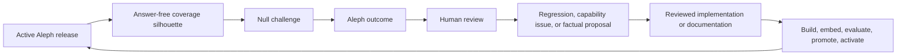

# Ouroboros: continuing the Aleph–Null improvement loop

This document is for the next Wildcat operator who wants to make Aleph more
capable by directing a controlled Project Null review wave, turning the useful
results into reviewed changes, and cutting the next evaluated Aleph release.
It is deliberately self-contained: possession of the earlier development chat
is not required.

The loop is called Ouroboros because its output becomes its next input:



This is directed corpus and evaluation improvement, not online model training.
Telegram traffic never alters Aleph's beliefs in place. A language model may
help select exact evidence or vary a synthetic question only behind explicit
validators; humans still decide what becomes code, an evaluation case, or
published Wildcat documentation.

## Current implementation boundary

Aleph currently uses `ExtractiveWriter`; Null currently uses its deterministic
catalogue. The organisation-authenticated shared tunnel and optional local
generation adapters described below are the target operating design, not a
claim that those components are already deployed. Before using the acquisition
commands, verify a reviewed infrastructure issue has installed the Tailscale
boundary, the separate SSH unit, model identity monitoring, and deterministic
fallback tests. If any part is absent, stop and implement it through the normal
issue/PR/deployment process. Never improvise by exposing Ollama or SSH publicly.

The corresponding Null-side guide is
[`project-null/OUROBOROS.MD`](https://github.com/wildcat-finance/project-null/blob/main/OUROBOROS.MD).

## The invariant

One person holds the Ouroboros operator lease at a time.

Other contributors may review responses, issues, diffs, and pull requests while
a lease is active. They must not start a second Null wave, alter production
state, activate an Aleph release, or attach another local model until the holder
records a handoff and releases the lease.

The lease is not a shared password. It combines:

1. an individually attributable Wildcat identity;
2. an approved device on a Wildcat-owned private network;
3. an individual SSH public key;
4. a restricted SSH account that cannot open a shell;
5. one fixed droplet-loopback reverse port; and
6. a bounded connection lifetime.

The fixed port is the technical mutex. The first valid operator to bind
`127.0.0.1:11435` on the droplet owns the model tunnel. A second attempt fails
immediately because the address is already in use. Repository files—even a
complete public ZIP—provide none of the identity, device, key, or network access
needed to reach that listener.

This mutex covers the local-model connection. GitHub editing and Telegram
commands remain governed by the operator ritual below. A future Null change may
consume the same droplet-local lease record to reject control commands from
non-holders; do not claim that enforcement exists until it is implemented and
evaluated.

## What the lease does not grant

The tunnel operator does not receive:

- the Aleph or Null Telegram token;
- the Data Gateway bearer token;
- the Aleph audit HMAC key;
- `/etc/aleph/*.env` or `/etc/project-null/*.env`;
- the Null SQLite database or raw Telegram records;
- a production shell through the tunnel identity;
- corpus-signing or GitHub merge authority; or
- permission to bypass issues, review, evaluation, promotion, or activation.

The bots, secrets, data, embeddings, release artifacts, and audit state stay on
the DigitalOcean droplet. Only a bounded prompt travels through the encrypted
tunnel to Ollama on the lease holder's Mac. Aleph's deterministic fallback must
continue working when no lease exists.

## Roles

### Ouroboros operator

The current lease holder may:

- attach one approved local Ollama runtime;
- pause, configure, resume, and re-pause a controlled Null wave;
- correlate and classify outcomes;
- open issue-first implementation or documentation work;
- build and evaluate candidates; and
- prepare a release or deployment for the separately authorized activation
  step.

### Reviewer

A reviewer may inspect Telegram outcomes, submit or check feedback, review
factual evidence, review pull requests, and reject unsafe candidates. Review
does not require the model-tunnel lease.

### Infrastructure administrator

An infrastructure administrator manages the Wildcat identity group, device
approval, Tailscale policy, restricted SSH listener, operator public-key roster,
and emergency revocation. This role does not automatically decide corpus truth.

### Release approver

The approver accepts a corpus diff or release activation under the existing
Aleph release policy. Holding the tunnel does not make an operator an approver.

## Organisation-only network boundary

The recommended boundary is a Wildcat-owned Tailscale tailnet using the
company's identity provider. Tailscale is not required by the application, but
it avoids publishing an Ollama or lease-SSH port and makes access revocable by
person and device.

### Preferred identity mode: Google Workspace group sync

If Wildcat uses Google Workspace and a Tailscale Standard, Premium, or
Enterprise plan:

1. create `ouroboros-operators@wildcat.finance` and a smaller
   `ouroboros-admins@wildcat.finance` group;
2. enable Google user and group provisioning in the Wildcat tailnet;
3. sync only the groups that require tailnet access; do not enable “Sync all
   users” merely for Ouroboros;
4. enable Tailscale device approval;
5. require an administrator to approve each work machine; and
6. force a directory sync after urgent membership removal rather than waiting
   for the normal sync interval.

Tailscale user approval and directory provisioning are mutually exclusive. In
this mode, synced group membership is the user-approval boundary; device
approval is the separate machine boundary.

Official references:

- [Tailscale Google Workspace provisioning](https://tailscale.com/docs/integrations/google-sync)
- [Tailscale device approval](https://tailscale.com/docs/features/access-control/device-management/device-approval)
- [Tailscale grants](https://tailscale.com/docs/features/access-control/grants)

### All-plan fallback: manually approved users

If directory provisioning is unavailable:

1. enable Tailscale user approval;
2. enable device approval;
3. define a manually maintained `group:ouroboros-operators` in the tailnet
   policy; and
4. remove both the user and their devices during offboarding.

Do not enable Tailnet Lock and device approval together; Tailscale documents
them as mutually exclusive. Device approval is the simpler starting choice for
this small, human-operated pool.

### Deny-by-default grant

Tag the droplet `tag:ouroboros-server`. Permit only the operator group to reach
the dedicated SSH listener on TCP 2222:

```json
{
  "grants": [
    {
      "src": ["group:ouroboros-operators@wildcat.finance"],
      "dst": ["tag:ouroboros-server"],
      "ip": ["tcp:2222"]
    }
  ],
  "tagOwners": {
    "tag:ouroboros-server": [
      "group:ouroboros-admins@wildcat.finance"
    ]
  }
}
```

Use `group:ouroboros-operators` instead in the manual fallback. Check the whole
tailnet policy before applying this fragment: Tailscale grants are additive, so
a pre-existing broad grant can defeat the intended restriction. Test one
authorized device and one ordinary member device.

Port 2222 listens only on the droplet's Tailscale address. Port 11435 listens
only on droplet loopback. Neither belongs in the DigitalOcean public firewall.

## Restricted lease listener

Use a second OpenSSH server instance rather than weakening the production admin
SSH configuration.

The one-time server setup is:

1. create an unprivileged `ouroboros-tunnel` account with no password, no sudo,
   no writable application directory, no interactive shell access, and
   `/bin/sh` only so the forced command can run;
2. store approved individual public keys in the root-owned
   `/etc/ssh/ouroboros_authorized_keys` file;
3. record each key fingerprint beside the operator's Wildcat identity in the
   infrastructure roster;
4. run a second `sshd` bound only to the Tailscale IPv4 address on port 2222;
5. permit remote forwarding only to `127.0.0.1:11435`;
6. force a four-hour lease command and close connections that attempt to keep a
   forwarding listener without opening the forced session; and
7. log successful key fingerprints at verbose level.

An illustrative `/etc/ssh/sshd_config_ouroboros` is:

```text
Port 2222
ListenAddress REPLACE_WITH_DROPLET_TAILSCALE_IPV4

HostKey /etc/ssh/ssh_host_ed25519_key
PidFile /run/sshd-ouroboros.pid
AuthorizedKeysFile /etc/ssh/ouroboros_authorized_keys

AllowUsers ouroboros-tunnel
PubkeyAuthentication yes
PasswordAuthentication no
KbdInteractiveAuthentication no
PermitEmptyPasswords no
PermitRootLogin no

AllowTcpForwarding remote
AllowStreamLocalForwarding no
GatewayPorts no
PermitListen 127.0.0.1:11435
PermitOpen none

AllowAgentForwarding no
X11Forwarding no
PermitTTY no
PermitTunnel no
PermitUserEnvironment no
MaxSessions 1

ForceCommand /usr/bin/timeout --signal=TERM 4h /usr/bin/sleep infinity
UnusedConnectionTimeout 30s
ClientAliveInterval 15
ClientAliveCountMax 3
LogLevel VERBOSE
```

`UnusedConnectionTimeout 30s` is important. OpenSSH does not count a remote
forwarding listener by itself as an open channel. An operator who tries `ssh
-N` instead of opening the forced session therefore loses the connection; the
documented command opens the session, and the forced command ends it after four
hours.

Each authorized-key line also carries defence-in-depth restrictions:

```text
restrict,port-forwarding,permitlisten="127.0.0.1:11435" ssh-ed25519 REPLACE_WITH_OPERATOR_PUBLIC_KEY operator@wildcat.finance
```

Before starting or reloading the second instance:

```bash
sudo /usr/sbin/sshd -t -f /etc/ssh/sshd_config_ouroboros
```

Never reload the normal admin SSH daemon with an unvalidated configuration.
The second listener should have its own systemd unit and journal.

## Operator onboarding

An infrastructure administrator completes all of these:

1. verify the person's current Wildcat role;
2. add them to the approved identity group, or approve them manually;
3. approve their specific Tailscale device;
4. receive a newly generated **public** SSH key and verify its fingerprint over
   a second channel;
5. add the restricted public-key line to the server roster;
6. map the operator's Telegram user ID into Null's root-only operator allowlist
   if they will run review commands; and
7. run positive and negative connectivity tests.

The SSH private key never leaves the operator's machine. A public key is not a
secret, but publishing it in this repository is still unnecessary. Tailnet
membership and device approval—not repository membership—are the network gate.

## Prepare a local model

The first evaluation candidate is the official Ollama
[`gpt-oss:120b`](https://ollama.com/library/gpt-oss:120b) package, with
`gpt-oss:20b` as a latency fallback. The M5 Max reference machine has 128 GiB
unified memory; operators with smaller machines must use a candidate that passes
the same Aleph/Null evaluation rather than silently changing model identity.

Ollama must bind local loopback only and run with cloud features disabled:

```text
OLLAMA_HOST=127.0.0.1:11434
OLLAMA_NO_CLOUD=1
OLLAMA_CONTEXT_LENGTH=32768
OLLAMA_NUM_PARALLEL=1
OLLAMA_MAX_LOADED_MODELS=1
OLLAMA_MAX_QUEUE=32
```

Pull, alias, and record the actual model identity:

```bash
/usr/local/bin/ollama pull gpt-oss:120b
/usr/local/bin/ollama create wildcat-gpt-oss-120b-v1 \
  -f /Users/YOUR_SHORTNAME/.config/aleph-ollama/Modelfile.gpt-oss-120b-v1
/usr/local/bin/ollama list
/usr/local/bin/ollama ps
lsof -nP -iTCP:11434 -sTCP:LISTEN
```

Expected listener: `127.0.0.1:11434`, never `0.0.0.0:11434`.

The server-side model configuration pins both alias and observed ID. A tunnel
to the wrong service or model fails the application identity check and invokes
the deterministic fallback.

## Acquire the lease

### 1. Claim the operational turn

Before connecting:

1. check the current Ouroboros tracking issue and Telegram training room for an
   active holder;
2. assign or comment with your Wildcat identity, intended task, start time, and
   latest planned stop time;
3. confirm Null is paused; and
4. record the active Aleph release, activation, evaluation, corpus, index, docs
   tag, and both monitor states.

Do not put tokens, environment values, raw questions, wallet identifiers, or
database content in the claim comment.

### 2. Verify both loopback services

On the Mac:

```bash
curl --fail --silent http://127.0.0.1:11434/api/version
/usr/local/bin/ollama list
```

Through the normal production operator path, confirm the droplet currently has
no generation lease:

```bash
sudo ss -ltnp 'sport = :11435'
```

No listener means the lease is free. A listener means another operator owns it;
do not kill it unless following the emergency-revocation procedure.

### 3. Start the bounded reverse tunnel

Verify the Ouroboros SSH host-key fingerprint out of band during first
onboarding. Then run:

```bash
ssh -T \
  -p 2222 \
  -o BatchMode=yes \
  -o StrictHostKeyChecking=yes \
  -o ExitOnForwardFailure=yes \
  -o ServerAliveInterval=15 \
  -o ServerAliveCountMax=3 \
  -i /Users/YOUR_SHORTNAME/.ssh/wildcat_ouroboros \
  -R 127.0.0.1:11435:127.0.0.1:11434 \
  ouroboros-tunnel@project-aleph
```

Do not add `-N`: the server requires the forced, time-bounded session. Do not
put this command in a persistent launch agent. Explicit acquisition prevents an
old operator's laptop from automatically reclaiming the lease after a network
change or reboot.

If another holder owns the lease, `ExitOnForwardFailure=yes` makes the command
fail. That is expected mutual exclusion, not an outage.

### 4. Verify from the droplet

```bash
curl --fail --silent http://127.0.0.1:11435/api/version
sudo ss -ltnp 'sport = :11435'
sudo journalctl -u ouroboros-sshd.service --since '10 minutes ago' --no-pager
```

Verify the model alias and ID through the application's health check before
enabling shadow or selective use. A successful `/api/version` alone proves only
that something speaks the Ollama API.

## Aleph's model boundary

The local model is optional. It must be inserted through `EvidenceWriter`; it
does not replace routing, retrieval, live reads, citation resolution, release
identity, or activation.

The first allowed model behaviour is exact evidence selection:

- input: sanitized question plus already-retrieved evidence records;
- output: strict JSON containing at most one claim, one supplied evidence ID,
  and an exact supporting substring;
- validation: schema, evidence-ID membership, exact byte support, topicality,
  and existing `AnswerEngine` checks; and
- failure: use `ExtractiveWriter` or abstain.

The model never receives a Telegram token, Gateway token, audit key, arbitrary
file, raw audit log, or live-value response. Live values remain code-rendered at
one verified block. The model cannot choose a route or activate a release.

Use modes in order:

1. `disabled` — current deterministic behaviour;
2. `shadow` — validate model output but deliver the current answer;
3. `selective` — use validated exact selection on allowlisted corpus routes;
4. `enabled` — only after every eligible route has passed its own gates.

Refusal, handoff, live-only, missing-input, easter-egg, and activation paths are
never model-owned.

## Direct a review wave

The Null-side document contains the command syntax. From Aleph's perspective,
the safe order is:

1. run both monitors;
2. verify the active release and model identity;
3. keep Null paused while selecting the wave and recording its boundary;
4. resume, run one probe or a burst of three, and pause immediately;
5. inspect every Aleph answer, route, live block, source, and abstention;
6. submit human feedback with one complete, newline-separated record per code;
7. inspect the result count before finalizing;
8. finalize only reviewed codes;
9. run maintenance and record candidate/raw-deletion counts; and
10. choose the next action from the reviewed disposition.

Volume is not progress. A wave is unfinished while any result is unexplained,
unreviewed, or ambiguously formatted.

## Turn a result into an Aleph change

### Regression or rejection case

1. export the immutable Null candidate set;
2. run Aleph's importer against the exact export bytes;
3. disposition every candidate as accepted, duplicate, rejected, deferred, or
   needs review;
4. add accepted cases to the golden evaluation through an issue-first PR;
5. send the complete reviewed disposition report back to Null; and
6. do not rewrite the immutable Null export.

### Routing change

Open a narrow Aleph issue. Change deterministic routing, add explicit tests,
run the full product evaluation, and keep the language writer out of the route
decision.

### Live-data requirement

Define a typed, bounded Data Gateway operation first. Pin its release and
health boundary, implement code rendering, add failure/one-block provenance
tests, then expose it to routing. Never solve missing live capability by asking
the model to guess.

### Factual corpus proposal

Null's proposal is not evidence. Locate the canonical deployed source or
reviewed Wildcat documentation, make the factual change in the authoritative
repository, obtain the required human review, and cut a new immutable docs tag.
Ten approved factual proposals open the normal batch review, but a consequential
correction can move sooner and no count bypasses review.

## Cut the next Aleph release

After reviewed source inputs exist:

1. update the manifest pin in an issue-first Aleph PR;
2. verify source refs, tag/signature policy, exclusions, metadata, deployment
   assertions, and watched-document rules;
3. build the candidate corpus and index with the pinned `bge-m3` identity;
4. inspect and approve the corpus diff;
5. run retrieval and the complete product evaluation;
6. create immutable candidate, evaluation, release, and activation artifacts;
7. activate with compare-and-swap against the recorded prior generation;
8. run startup, monitor, Telegram, Gateway, live, and history canaries;
9. retain the prior release for pointer-only rollback; and
10. publish the new answer-free coverage silhouette for Null.

Follow [`ops/OPERATIONS.md`](ops/OPERATIONS.md),
[`ingest/PIPELINE.md`](ingest/PIPELINE.md),
[`ingest/REVIEW.md`](ingest/REVIEW.md), and
[`eval/RUNBOOK.md`](eval/RUNBOOK.md). If this guide conflicts with those files
or `manifest.yaml`, the narrower source of truth wins.

## Record a handoff

Before releasing the lease, leave a scrubbed handoff containing:

- operator Wildcat identity;
- start and stop times;
- issues/branches/PRs touched;
- Aleph source commit and active release identities;
- Null run/mode/paused state and count-only queue/candidate totals;
- model alias, ID, Ollama version, prompt/schema version, and mode;
- waves run and human-reviewed dispositions by count;
- new corpus, routing, live-data, or rejection work;
- tests/evaluations/monitors run and their result;
- deployment or rollback performed; and
- the exact safe next action.

Never include tokens, environment values, raw database rows, private Telegram
identifiers, unredacted questions, or model reasoning.

## Release the lease

1. pause Null unless the recorded operating state explicitly requires it live;
2. set local-model use back to the intended safe mode;
3. run both monitors and record the final count-only checkpoint;
4. stop the foreground SSH command with `Ctrl-C`;
5. verify `127.0.0.1:11435` is no longer listening on the droplet;
6. mark the tracking issue/comment as released; and
7. hand the next operator the issue/PR links, not secrets.

Do not leave an auto-reconnecting tunnel behind.

## Emergency revocation

An infrastructure administrator should:

1. remove or suspend the person in the Wildcat identity group;
2. force the directory sync, or remove the manually approved Tailscale user;
3. revoke/remove the device;
4. remove the public key from `/etc/ssh/ouroboros_authorized_keys`;
5. remove the Telegram user ID from Null's operator allowlist;
6. if the person holds the lease, terminate the dedicated account's current
   sessions and verify port 11435 disappears; and
7. inspect the separate SSH journal and application audit for the bounded
   interval.

A typical emergency release is scoped to the dedicated account:

```bash
sudo pkill -TERM -u ouroboros-tunnel
sudo ss -ltnp 'sport = :11435'
```

This terminates the current lease for everyone; use it only when the active
holder must be removed. It does not rotate Telegram or Gateway credentials
because the lease never possessed them.

## Stop conditions

Pause Null, disable model use, and release or revoke the lease if any of these
occurs:

- a fabricated or unrelated citation;
- a model-created live value;
- a secret or identifier appears in a prompt or log;
- Ollama or port 11435 is exposed beyond loopback;
- the observed model identity differs from the configured identity;
- deterministic fallback fails;
- bot delivery recurses or duplicates;
- feedback batch formatting processes fewer records than intended;
- active release/corpus/index identity changes unexpectedly;
- an operator cannot explain a result; or
- another person appears to be directing the live loop concurrently.

The correct response to uncertainty is a pause and a recorded checkpoint, not a
larger burst.

## Operator completion checklist

- [ ] One attributable Wildcat operator held the lease.
- [ ] No credential moved to the operator machine or repository.
- [ ] Ollama and the reverse listener remained loopback-only.
- [ ] Model alias and observed ID matched.
- [ ] Null was paused before and after every bounded wave.
- [ ] Every probe was reviewed or deliberately left to expire under policy.
- [ ] Feedback and finalization result counts matched the submitted codes.
- [ ] Factual proposals were separated from regressions.
- [ ] Every repository mutation had its own issue-first trail and review.
- [ ] Any release passed build, diff, evaluation, promotion, activation, and
      monitor gates.
- [ ] A scrubbed handoff names the exact next action.
- [ ] The SSH process ended and droplet port 11435 was released.
