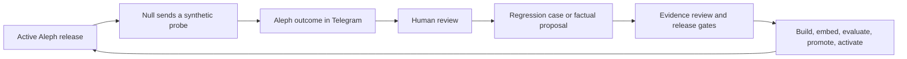

# Project Aleph

Project Aleph is Wildcat Protocol's evidence-backed Telegram interface. It
answers protocol questions from an immutable, versioned corpus and reads current
mainnet state through narrow, typed Data Gateway operations.

Aleph is running in the reference production deployment. Its published
documentation is pinned at `wildcat-docs@aleph-v0.3`; its live-data boundary is
pinned to `mainnet/v2.0.30`; and its release index uses the manifest-locked
`bge-m3` embedding identity. Every release must pass the 142-case product
evaluation before an operator can activate it.

The system is deliberately conservative. Aleph would rather ask for context,
abstain, or refuse than produce a plausible answer without relevant evidence.

## What Aleph does now

Aleph can:

- explain deployed Wildcat v2 protocol mechanics from pinned source and
  published documentation, with commit-pinned citations adjacent to the claims
  they support;
- read current registry, market, lender-account, withdrawal-queue, and
  borrower-to-markets state at one verified Ethereum block;
- read the latest one to ten borrowing, repayment, deposit, or withdrawal-request
  events for an explicitly addressed market, with transaction and block provenance;
- keep retrieved explanation separate from deterministically rendered live
  numbers;
- correct false premises, ask for missing addresses, and distinguish an
  evidence gap from an operational failure;
- refuse advice, borrower assessment, inferred intent, unsupported chains,
  private or bulk lender data, and attempts to extract hidden context; and
- prepare a bounded human-handoff draft without contacting anyone unless a
  human explicitly confirms it.

In Telegram, use `/ask@ProjectAlephWildcat_bot <question>` in a group. Private
messages can be asked directly. Ambient group messages and ordinary mentions
are ignored because Telegram privacy mode remains enabled.

Aleph also contains one intentionally useless answer: ask whether it is vegan.

## Where the current boundary is

Aleph treats a bare mainnet market address or canonical Wildcat lender-market
URL as a live object. Direct APR, reserve-ratio, capacity, delinquency, and
grace-period questions use the typed market read without requiring the word
“current”; a missing address produces one targeted clarification. Mechanism
questions remain corpus-backed, and every live response retains one-block Data
Gateway provenance.

Aleph does not discover a market reliably from an approximate rate, a borrower
name, or other fuzzy description. That requires indexed live discovery, not a
larger language-model prompt. Transaction-history questions therefore require
the market contract address. The live path returns at most ten deterministically
ordered events and does not replace the complete Wildcat market CSV export.

Corpus answers currently use a strict extractive writer. It selects one coherent,
topic-relevant source by default and refuses unsupported synthesis. Fluent
paraphrasing remains future work until an equally strict claim verifier exists.

Human handoff delivery is disabled until an owner, destination, retention policy,
and idempotent delivery contract are named. This does not block normal answers.

## The Aleph–Null cycle

[Project Null](https://github.com/wildcat-finance/project-null) is Aleph's
Bizarro counterpart: Null asks questions and hallucinates scenarios; Aleph must
answer, clarify, abstain, point elsewhere, or refuse. The interaction creates a
controlled feedback loop without turning synthetic text into protocol truth.



The human boundary is the point of the loop:

1. Null generates an ordinary, awkward, ambiguous, adversarial, or nonsensical
   question with a private test intent.
2. Aleph handles that question through the same Telegram surface used by people.
3. A reviewer judges the outcome. A useful result may become a regression case,
   routing fix, live-data requirement, corpus-gap proposal, or rejection test.
4. Finalisation anonymises the retained question and removes its Telegram
   linkage. Raw identifiers are retained for no more than 30 days.
5. Regression candidates and factual corpus proposals remain separate. A
   reviewer must attach approved evidence to any factual proposal.
6. Aleph validates each immutable Null regression export and records an explicit
   disposition for every candidate. Accepted cases enter the golden product
   evaluation, duplicates bind to existing cases, and capability gaps retain a
   linked issue. The importer rejects factual proposals.
7. Ten human-approved factual proposals trigger an Aleph corpus-release review.
   Ten is a batching line, not an automatic promotion threshold; consequential
   corrections can be reviewed sooner.
8. A candidate still has to build, embed, pass evaluation, receive attributable
   approval, and be activated by an operator.

The first production Null export, `e168ea3628343c39c9cf`, contains fourteen
regression candidates and no factual proposals. Seven add golden cases and seven
map to existing coverage. `eval/null_import.py` reproduces that complete
disposition from the immutable export bytes.

Null is never an oracle, an autonomous corpus editor, or a trusted source merely
because it produced an interesting question. Conversely, Aleph does not train
itself on Telegram traffic. The cycle strengthens the reviewed corpus and eval
set, not the bot's beliefs in place.

## What remains to be built

The evidence foundation is in place. The first full corpus audit, targeted
rechunk, human review, rebuild, evaluation, promotion, activation, and
production smoke are complete. The active corpus passes the structural gates
added by [issue #33](https://github.com/wildcat-finance/project-aleph/issues/33)
and the answer-integrity guardrails from
[PR #34](https://github.com/wildcat-finance/project-aleph/pull/34).

Remaining engineering work proceeds in this order.

### 1. Add constrained live discovery

Support market and borrower lookup by stable public identifiers, then consider
bounded screening such as “markets around 8%.” Discovery must return candidates
from indexed live facts; it must not guess an address from corpus similarity or
allow the language writer to rank borrower quality.

### Separate operating lane: exercise the Null review loop

Run bounded mixed probe waves in the developer room as a separate operational
process. Review and finalise useful cases, keep regression and factual queues
separate, and open the first corpus-release review at ten approved factual
proposals. Probe volume alone is not progress; reviewed, reproducible cases are.
This lane supplies evidence about what to build, but it is not an autonomous
build or release process.

### 2. Cut the next evidence release when reviewed inputs exist

When human review approves new chunk or factual changes, apply them to a new
immutable corpus, rebuild the locked embedding index, run retrieval and product
evaluation, inspect the corpus diff, promote only if every gate is true, and
activate with compare-and-swap. Keep the previous release available for
pointer-only rollback. A proposal count starts review; it never bypasses these
release invariants.

### 3. Widen the interface only after the evidence path is stable

Broaden the Telegram trial after citation relevance, live routing, privacy,
restart safety, and the Null review workflow hold under developer use. Enable a
human handoff destination only after its ownership and data contract are real.

## Trust and release model

Aleph's guarantees come from boundaries around the model, not confidence in it.

**Sources are default-deny.** `manifest.yaml` pins allowed repositories, refs,
files, legal-document digests, deployment assertions, and exclusions. Deployed
source takes precedence over newer but undeployed branches.

**Corpus and embedding identity are immutable.** A release binds corpus bytes,
source provenance, index payload, backend, model digest, dimensions,
normalisation, and query-prefix policy. Query-time identity must match exactly.

**Authority tiers stay visible.** Verified deployed source and canonical
artifacts remain distinct from published explanatory prose. Prerelease v2.5
material is isolated unless the user explicitly asks about it.

**A citation is a claim-support contract.** Human-visible evidence is resolved
back to the exact corpus bytes. Only citations attached to claims that survive
answer assembly are shown. Retrieval hits are not dumped into the response as a
reading list.

**Live values are code-rendered.** The model does not supply balances, rates,
blocks, or market status. The gateway must pass health, integrity, redundancy,
and zero-lag checks; every query is pinned to the checked block; typed code
renders the result with its block and gateway release.

**Promotion and activation are separate.** Product evaluation binds results to
the exact candidate and tool hashes. Promotion requires every manifest gate to
be true. Activation is a later attributable operation, and rollback creates a
new pointer generation without rebuilding or deleting artifacts.

**Auditing avoids raw question retention.** Production audit records contain
release identity, route, citations, live block, refusal reason, and an HMAC
question fingerprint—not the raw question, answer, or wallet address.

## Build and verify a release

Python 3.10 or later is required. Corpus construction uses GnuPG, `pyyaml`, and
`numpy`; Solidity ingestion uses Docker by default and can use Podman through
`CONTAINER_RUNTIME`.

```bash
python3 -m venv .venv
source .venv/bin/activate
pip install pyyaml numpy

python3 release.py \
  --manifest manifest.yaml \
  --solc ingest/solc-container \
  --fetch-sdk \
  --artifacts artifacts
```

For a candidate diff, add
`--against artifacts/corpus/<previous-id>/chunks.jsonl`. Reviewers approve the
diff separately; building it does not make it active.

The principal checks are:

```bash
python3 test_release.py
python3 test_retrieval.py
python3 test_live.py
python3 test_agent.py
python3 test_evaluation.py
python3 test_telegram.py
python3 test_operations.py
```

Run the full ingestion and embedding checks before cutting an evidence release.
See the runbooks below for the exact evaluation, promotion, activation, monitor,
and rollback commands.

## Repository guide

| Area | Source of truth |
| --- | --- |
| Corpus and runtime policy | [`manifest.yaml`](manifest.yaml) |
| Ingestion rationale and limits | [`aleph-ingestion-manifest.md`](aleph-ingestion-manifest.md) |
| Answer modes and claim boundary | [`ANSWERING.md`](ANSWERING.md) |
| Telegram delivery and privacy | [`TELEGRAM.md`](TELEGRAM.md) |
| Production activation and rollback | [`ops/OPERATIONS.md`](ops/OPERATIONS.md) |
| Corpus build and review | [`ingest/PIPELINE.md`](ingest/PIPELINE.md), [`ingest/REVIEW.md`](ingest/REVIEW.md) |
| Adversarial ingestion guarantees | [`ingest/ADVERSARIAL.md`](ingest/ADVERSARIAL.md) |
| Evaluation and model decision | [`eval/RUNBOOK.md`](eval/RUNBOOK.md) |
| Null's feedback-loop contract | [`Project Null`](https://github.com/wildcat-finance/project-null), [`EXPORTS.md`](https://github.com/wildcat-finance/project-null/blob/main/EXPORTS.md) |

The main runtime path is:

```text
manifest.yaml
  -> release.py (corpus + index + release record)
  -> retrieval.py / live.py
  -> agent.py
  -> telegram.py / serve.py
  -> promotion.py
  -> activation.py
  -> monitor.py / audit.py
```

If this README disagrees with `manifest.yaml`, the manifest wins and this file
needs correction.

---

**A note on the name.** Borges' Aleph is the point in space that contains every
other point, seen simultaneously and without distortion. The last part is the
design constraint, not the first.
